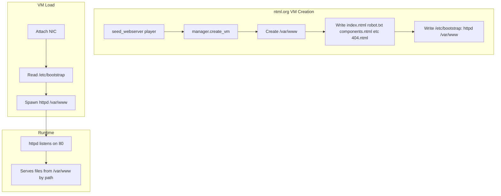

# ntml.org HTTP Server and VM Bootstrap

This document describes the ntml.org HTTP server VM, the `httpd` bin program, and the VM bootstrap pattern used to auto-start processes when a VM is loaded.

---

## Overview

The cluster runs a dedicated HTTP server VM (ntml.org) for testing the HTTP protocol. The server listens on port 80 and serves files from `/var/www` (file-based, no hardcoded routes). VMs can declare startup processes in `/etc/bootstrap`; when a VM is loaded, the cluster reads this file and spawns each listed program automatically.

---

## ntml.org HTTP Server VM

### Purpose

The ntml.org VM is a system VM that runs an HTTP server for protocol testing. It is similar to Haru's VM but dedicated to serving HTTP traffic. Clients (e.g. Haru's terminal) can connect to ntml.org and fetch pages over the HTTP protocol.

### Creation

- **Owner:** The `webserver` player (seeded via `seed_webserver()` in `player_service`).
- **Hostname:** `ntml-server`
- **DNS name:** `ntml.org` (when DNS resolution is available).
- **Creation flow:** In `load_game_vms` (main.rs), if the webserver player has no VM, the cluster creates one with `manager.create_vm(config)`, creates `/var/www`, writes seed files (index.ntml, robot.txt, components.ntml, styling.ntml, etc., 404.ntml), and writes `/etc/bootstrap` with `httpd /var/www` so the server starts on load.

### Bootstrap

The ntml.org VM has `/etc/bootstrap` containing:

```
httpd /var/www
```

When the VM is loaded, the cluster reads this file and spawns `httpd` from `/bin/httpd` with argument `/var/www`. No hostname checks in Rust—the VM configures itself via the bootstrap file.

### /var/www Layout

Content lives in the VM filesystem (like Linux `/var/www` or `/var/www/html`):

| File | Purpose |
|------|---------|
| `index.ntml` | Home page (served for `/` or empty path) |
| `robot.txt` | Plain text (e.g. "Robot: operational") |
| `components.ntml` | Component reference |
| `styling.ntml` | Style reference |
| `document-format.ntml` | Document structure |
| `examples.ntml` | Complete examples |
| `lua-api.ntml` | Lua API reference |
| `best-practices.ntml` | Best practices |
| `http.ntml` | HTTP protocol for Lua |
| `404.ntml` | Custom 404 body when no file matches |

### NTML in the Browser

When the in-app Browser fetches a page with `Content-Type: application/x-ntml`, it converts the NTML YAML to HTML using the NTML HTML renderer. The renderer supports all NTML components and style properties. Image `src` paths are resolved against the page URL (e.g. `img/logo.png` on `ntml.org/about` loads from `http://ntml.org/img/logo.png`). Pages can declare `head.scripts` for Lua and `head.imports` for reusable components. See [docs/ui-markup-language.md](../../docs/ui-markup-language.md) for the full NTML spec and Browser rendering details.

---

## httpd Bin Program

### Location

`/bin/httpd` — included in `DEFAULT_BIN_PROGRAMS` and written during VM bootstrap (create_vm).

### Arguments

- **First arg:** Root folder path (e.g. `/var/www`). Default: `/var/www` if omitted.

### Behavior

- Listens on port 80 via `net.listen(80)`.
- Serves **files from the folder** — no hardcoded routes. Request path maps to filenames.
- Loops: `net.recv()` for packets, filters by `dst_port == 80`, parses with `http.parse_request`, resolves path to file, reads with `fs.read`, builds response with `http.build_response`, sends via `net.send(src_ip, src_port, res)`.

### File Matching Rules

| Request path | Behavior |
|--------------|----------|
| `/` or empty | Map to `index` — look for index.ntml, index.txt, etc. |
| `/robot` (no ext) | Find files with base name `robot`. If exactly one → serve it. If multiple (robot.txt, robot.ntml) → 404 (ambiguous; client must use /robot.txt or /robot.ntml). |
| `/robot.txt` (with ext) | Look for `robot.txt` exactly. Serve if exists, else 404. |
| No match | 404. If `404.ntml` or `404.txt` exists in folder, serve it as body; else empty body. |

### Content-Type

Inferred from file extension: `.ntml` → `application/x-ntml`, `.txt` → `text/plain`, `.html` → `text/html`, else `application/octet-stream`.

### Dependencies

- `http` Lua API: `http.parse_request`, `http.build_response` (with optional headers).
- `net` API: `net.listen`, `net.recv`, `net.send`.
- `fs` API: `fs.ls`, `fs.read`.

See [http-protocol.md](http-protocol.md) for the HTTP protocol and Lua API details.

---

## VM Bootstrap Pattern

### Purpose

VMs can declare which programs to run at startup. Instead of hardcoding hostname checks in Rust, each VM configures itself via a file in its filesystem.

### File

**Path:** `/etc/bootstrap`

- Created manually or during VM creation (e.g. ntml.org gets it when created).
- Not created by default—VMs without this file simply skip bootstrap.

### Format

One program per line. Optional arguments.

```
httpd /var/www
# ssh-server
echo hello world
```

- **Comments:** Lines starting with `#` are ignored.
- **Empty lines:** Ignored.
- **Program line:** First token = program name (resolved from `/bin/<name>`). Remaining tokens = arguments.
- **Examples:**
  - `httpd /var/www` → spawn `/bin/httpd` with `["/var/www"]`
  - `echo hello world` → spawn `/bin/echo` with `["hello", "world"]`

### When It Runs

When the cluster loads VMs in `load_game_vms`:

1. For each VM, after attaching the NIC (if it has an IP).
2. Read `/etc/bootstrap` from the VM's filesystem.
3. For each non-comment, non-empty line: parse program and args, read `/bin/<program>`, spawn the process as `root`.

VMs without `/etc/bootstrap` get `None` from `read_file` and skip.

### Flow

```
VM loaded → Attach NIC → Read /etc/bootstrap → For each line: spawn /bin/<program> [args]
```

### RestoreDisk

When RestoreDisk re-bootstraps a VM (destroy fs + bootstrap_fs + /bin/*), `/etc/bootstrap` is **not** recreated. The restore is a full reset; users must recreate `/etc/bootstrap` if they had one.

---

## Architecture Summary



---

## Testing

From another VM (e.g. Haru's terminal), connect to ntml.org and fetch pages:

- Use the ntml.org VM's IP (shown in cluster logs) until DNS resolution for `ntml.org` is available.
- Example: `net.connect("ntml.org", 80)` or `net.connect("<vm_ip>", 80)`, send GET request, parse response.

Integration test `test_httpd_routes` verifies `/` returns NTML home and `/robot` returns plain text.
